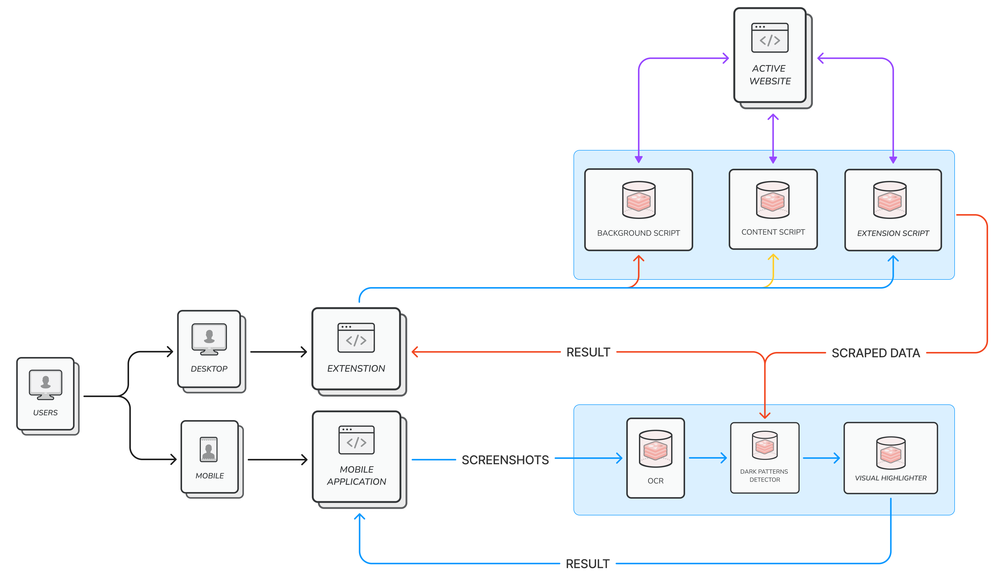

# N.O.V.A.S - Nurturing Online Vigilance with Advanced Safeguards

**Welcome to N.O.V.A.S**, your reliable ally in the expansive realm of online shopping. Have you ever found yourself on e-commerce websites, feeling nudged towards decisions that left you uncertain? You're not alone. Frequently, these platforms employ subtle tactics like flashing timers and concealed fees to guide users in unexpected directions.

Enter N.O.V.A.S – your personal shield against these sly maneuvers known as dark patterns. Think of N.O.V.A.S as your digital guardian, tirelessly scanning for hidden traps and misleading strategies that may compromise your online security.

N.O.V.A.S is more than just a tool; it's your companion in the digital world, standing alongside you to ensure your online journey is seamless, transparent, and devoid of deceitful tactics.

In this guide, we'll explore how N.O.V.A.S operates and how it empowers you to navigate the internet with confidence and clarity. Join us on this journey as we unveil the secrets to a safer and more transparent online experience with N.O.V.A.S.

## Table Of Contents
1. [Approach](#approach)
   
    - [Semantic Analysis](#semantic-analysis)
    - [Visual Analysis](#visual-analysis)
    - [Integration](#integration)
    - [Real-time Detection](#real-time-detection)
      
3. [System Architecture](#system-architecture)
   
    - [Extension Architecture Overview:](#extension-architecture-overview)
    - [Mobile Application Architecture Overview:](#mobile-application-architecture-overview)
      
5. [The Extension's Backend](#the-extensions-backend)
   
    - [Dataset](#dataset)
    - [TFIDF Preprocessing](#tfidf-preprocessing)
    - [Model Accuracy Comparison](#model-accuracy-comparison)
    - [XGBoost Model Configuration](#xgboost-model-configuration)
      
7. [The Mobiles Backend API](#the-mobiles-backend-api)
   
    - [Purpose](#purpose)
    - [How It Works](#how-it-works)
    - [Key Features](#key-features)
    - [Integration](#integration-1)
      
9. [Setting up Chrome Extension](#setting-up-chrome-extension)

    - [Prerequisites](#prerequisites)
    - [Setup](#setup)
11. [Future Scope](#future-scope)

## Approach

### Semantic Analysis

NOVAS employs advanced Natural Language Processing (NLP) techniques to scrutinize website content. This involves identifying misleading language, ambiguous terms, or coercive phrases commonly associated with dark patterns.

### Visual Analysis

The system utilizes computer vision algorithms to analyze website layouts, UI elements, and visual cues. This process focuses on detecting patterns such as deceptive buttons, hidden costs, or misleading progress indicators.

### Integration

NOVAS seamlessly integrates both semantic and visual analyses into a unified detection system. This integration leverages NLP models for textual content and computer vision algorithms for visual elements.

### Real-time Detection

Implementing real-time analysis during user interaction with web pages, NOVAS provides immediate feedback on the presence of potential dark patterns. This ensures users are promptly informed during their browsing experience.

## System Architecture

Here's the working of our **Chrome Extension** and **Mobile Application**

### Extension Architecture Overview:

The Chrome extension for detecting dark patterns comprises a popup interface that users interact with by clicking on the extension icon. This interface triggers a detection process, communicating with a background script, which, in turn, signals a content script to initiate data extraction from the active webpage.

The content script, injected into the webpage, gathers information about HTML elements such as tags, text, id, class, location, height, and width which is deleted after the process is completed. This data is structured in JSON format and transmitted to a cloud-hosted server for dark pattern detection, leveraging machine learning models.

The server processes the received JSON data, utilizing its dark pattern detection model to identify patterns within the webpage. The results, including the type and count of detected dark patterns, along with specific text elements identified, are sent back to the content script.

Upon receiving the server's response, the content script highlights the identified dark pattern elements on the webpage. Simultaneously, it communicates with the popup to relay the detected dark pattern details. The popup, in turn, displays these results to the user in an easily comprehensible format, offering insights into the nature and prevalence of dark patterns on the visited website.

This architecture maintains a clear flow of communication between the user interface, background processes, content script, and the cloud-based server. It enables efficient detection of dark patterns, enhancing the user's understanding of potential manipulations within the displayed content.

### Mobile Application Architecture Overview:

Users kickstart the screenshot analysis process in the mobile app by uploading an image, triggering an Optical Character Recognition (OCR) algorithm. This advanced OCR mechanism extracts text content from the screenshot, transforming it into a structured format.

The extracted text data undergoes Base64 encoding, enhancing security and efficiency during transmission to the centralized Python server. The securely transmitted data includes both the Base64-encoded text and the original screenshot image, ensuring data integrity throughout the process.

On the server side, machine learning algorithms analyze the Base64-encoded text data and concurrently examine the screenshot image for the presence of dark patterns. If identified, the Python server dynamically modifies the image to highlight detected dark patterns while preserving the original context.

The enhanced image, along with any additional data, is then transmitted back to the mobile application, creating a feedback loop. Upon receiving the server response, the mobile app decodes any Base64-encoded data, ensuring accurate interpretation and display.

Users ultimately receive the modified image, providing visual insights into the presence of dark patterns within the uploaded screenshot. This comprehensive architecture seamlessly integrates OCR, machine learning, and dynamic image modification to enhance user understanding of potential manipulations within the analyzed content.

 

## The Extension's Backend

### Dataset 

The foundation of the dark pattern texts within the [dataset](https://github.com/yamanalab/ec-darkpattern/blob/master/dataset/dataset.tsv )  traces back to Mathur et al.’s study in 2019. This compilation encompasses 1,818 instances extracted from diverse shopping sites. To ensure a well-rounded and comprehensive dataset, non-dark pattern texts are thoughtfully included. These non-dark pattern texts are sourced from e-commerce sites, strategically accessed and segmented based on insights gleaned from Mathur et al.'s study.

### TFIDF Preprocessing

This rich collection of textual information undergoes a transformative process through TFIDF (Term Frequency-Inverse Document Frequency) preprocessing. TFIDF is a powerful technique that transforms text data into numerical vectors, capturing the significance of words within the dataset. The process involves calculating the frequency of words in context to the sentence. During this process, English stop words are excluded, and the number of features is limited to 5000. This ensures that the TFIDF transformation yields concise yet informative representations of the original textual data.

### Model Accuracy Comparison

Below is a comparison of accuracy scores for different models, including logistic regression, random forest, support vector machine, naive Bayes, and XGBoost that we have tried during the R&D stage of product development. Out of this the best model is the XGB Classifier which we have used in this product

| Model                    | Accuracy |
|--------------------------|----------|
| Logistic Regression      | 0.9008   |
| Random Forest            | 0.9235   |
| Support Vector Machine   | 0.9008   |
| Naive Bayes              | 0.9037   |
| XGBoost                  | 0.9405   |

### XGBoost Model Configuration

The XGBoost (XGB) classifier is configured with a learning rate of 0.01, parallel processing (n_jobs) set to 4, and 1000 estimators. This strategic configuration ensures the model is adept at learning patterns within the dataset and contributes to its high accuracy in the context of dark pattern detection.

## The Mobiles Backend API

The NOVAS mobile API is a powerful tool designed to enhance user experience within mobile applications by identifying and addressing potentially deceptive user interfaces. Dark patterns refer to design elements that may manipulate or mislead users, and this API aims to detect and highlight such patterns in images.

### Purpose

The primary purpose of the NOVAS mobile API is to empower mobile applications to create a more transparent and honest user experience. By analyzing images containing user interfaces, the API identifies elements that might be designed to deceive or manipulate users, thus allowing developers to take appropriate actions.

### How It Works

The API utilizes advanced image processing techniques and Optical Character Recognition (OCR) technology to extract text and analyze the layout of the user interface. It then communicates with an external dark pattern detection service, which evaluates the extracted information to identify potential dark patterns. The API finally returns highlighted images, showcasing the detected dark patterns, along with relevant information.

The API employs a text highlighting mechanism to draw attention to identified dark patterns. When potential dark patterns are detected within the user interface, the API dynamically highlights the relevant text on the image. This highlighting is achieved by adding a visually distinct color around the text, making it easily noticeable to both developers and end-users.

#### Key Features

- **Dark Pattern Detection:** The API identifies and highlights potential dark patterns in user interface images, such as misleading prompts, hidden costs, or coercive tactics.
  
- **Highlighting:** The API returns an image with all the detected dark patterns Highlighted.

- **Privacy:** All the images are sent in encoded format, and when the processing is done, the images are deleted. No data is permanently stored to respect the user's privacy.

### Integration

The NOVAS mobile API is designed for easy integration into the mobile application. Developers can incorporate the API, by hosting it in the cloud, or a local server.

## Setting up Chrome Extension 

### Prerequisites

- Chromium Based Borwser like chrome, brave, or edge.

### Setup

1. **Download and Extract the Project:**

    - Find the zip file attached in the email.
    - Download the attached zip file to your local machine.
    - Extract the contents of the zip file to a directory of your choice.

2. **Load the Extension:**

    - Open the browser and go to `<browser_name>://extensions/`.
    - Enable "Developer mode" using the toggle switch in the top right corner.

    ### Edge
    

    ### Brave
    
    
    ### Chrome
    

    - Click on the **Load unpacked** button.
    - Select the directory where you extracted the project files and click **Select Folder.**
  
    

3. **Verify the Extension:**

    - The extension with name **NOVA** should now appear in the list of installed extensions.
    - Ensure that the extension is enabled.

    

4. **Test the Extension:**

    - Open a website in Google Chrome.
    - Locate the extension icon in the toolbar.

https://github.com/PreranaYekkele/DPBH/assets/66351075/4cb62686-0db4-4a3b-9680-a2684b07693b

## Future Scope

In the ongoing effort to keep the model current, a dataset will be systematically constructed by scraping information from the dark patterns channel on Reddit, a platform known for providing regular updates on emerging dark patterns. This initiative seeks to create a dynamic, crowd-sourced, and open-source database that is easily accessible for various applications. The collected dataset can be further transformed into a Knowledge Graph, enabling queries and insights extraction related to dark patterns. Leveraging Language Model-based queries will enhance the precision of information retrieval.

Moreover, it's crucial to note that the model will undergo regular updates to align with the evolving landscape of dark patterns, ensuring its continued effectiveness and relevance.

